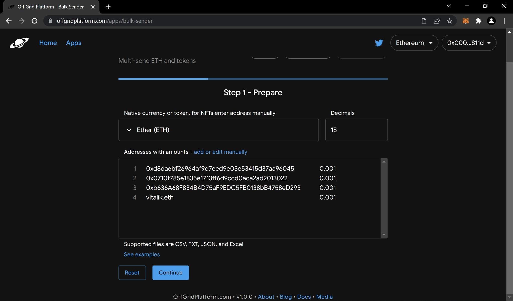
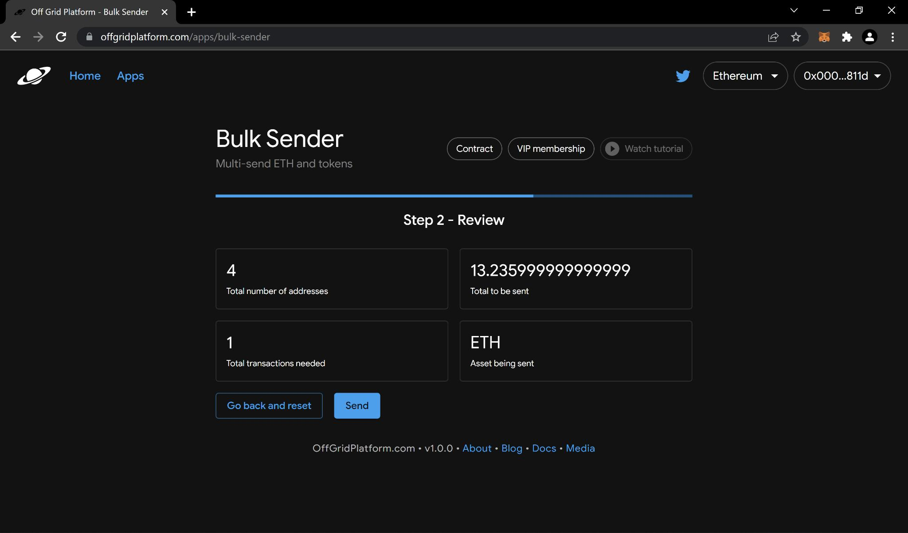
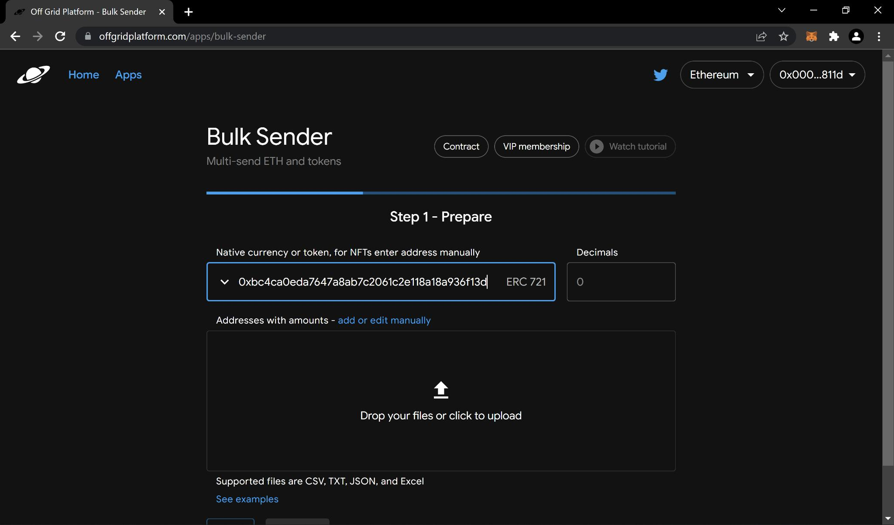
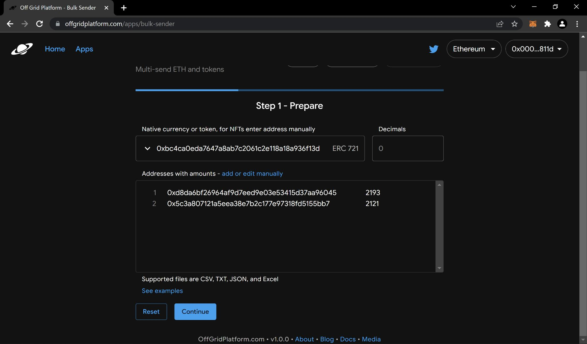
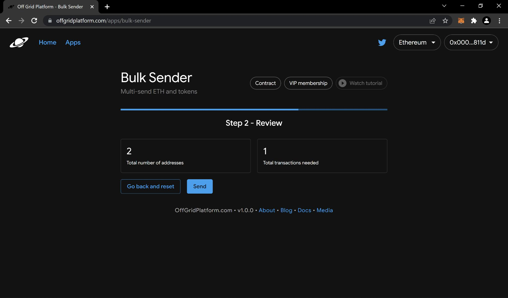
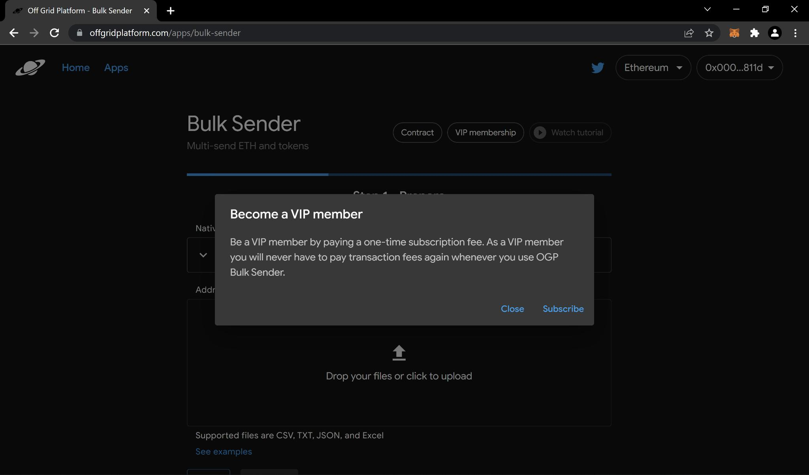

# Guide

To get to OGP Bulk Sender, visit [https://www.offgridplatform.com/apps](https://www.offgridplatform.com/apps) and then click "Bulk Sender" from the application menu. Once you have done this, click "Launch" to launch the application or you may visit the application directly by going to [https://www.offgridplatform.com/apps/bulk-sender](https://www.offgridplatform.com/apps/bulk-sender).

<figure><figcaption></figcaption></figure>

## Sending in bulk

This section will walk you through on how to send cryptocurrencies and NFTs in batches, to many addresses. We have divided this section in two separate parts, one for cryptocurrencies and the other for NFTs.

You can send native currencies such as Ether or tokens in batches using OGP Bulk Sender. There are 3 simple steps involved when using OGP Bulk Sender. The first step is preparation, second step is review or validation, and third step is to send the transactions to the blockchain. Step 1 requires that you follow the format that is supported for bulk sending crypto. Examples that follow this format are provided to help you get started. To view examples, click on the link at the bottom where it says "See examples" and you will be shown a dialog message as shown in the image below.

Follow these examples and update them according to your needs - be sure to replace example data for addresses and their values with your real data.

<figure><figcaption>
Bulk Sender examples dialog
</figcaption></figure>

Once you have compiled a list of addresses and values for bulk sending, you are ready to move to the next steps.


Pro Tip - before executing on mainnet, you can first test things out on your desired network's respective testnet. To do that, connect to your testnet in your wallet and OGP will automatically detect the testnet if it is supported. You may find a list of supported testnets in [Supported networks](../../supported-networks.md).


### Bulk sending native currency and ERC-20 tokens

If you want to send a native currency such as Ether to your addresses, simply click the dropdown icon where it says "Select or enter token address" and select the native currency. If you are going to send ERC-20 tokens, you may select the token if it is provided in the dropdown or you may enter the address of the token manually.

<figure><figcaption>
Bulk Sender select or enter token address
</figcaption></figure>

Once you have selected or entered your cryptocurrency's address, be sure to verify the decimals entry is correct.&#x20;

Now you're ready to upload those addresses and their values you created. To do that, you have two options, one is to enter them manually or upload them via a file. To enter manually, simply click on "add or edit manually" and paste the contents which include your addresses and their values. To upload a file that already has these contents, simply click the upload area where it says "Drop your files or click to upload" and you will be prompted to select a file - note that you may also drag and drop your file here.


Pro Tip - we always recommend uploading a file as you can always maintain a copy and perhaps reuse it in the future.


Great, so you have selected the cryptocurrency you would like to multi-send and have uploaded the data related to your respective addresses or recipients following the supported format for native currencies or ERC-20. You should now see the "Continue" button light up as shown in the example image below. You are ready to proceed to the next step to validate your transaction data before sending it to be processed by the OGP Bulk Sender contract. Click the "Continue" button to proceed.

<figure><figcaption></figcaption></figure>

Now we should be on the second step which is to review and validate the transactions needed in order to bulk send the crypto. Carefully make sure the total number of addresses, total amount to be sent, and asset being sent are correct. You will see 1 transaction per 255 addresses.

<figure><figcaption></figcaption></figure>

Upon verifying the data is correct, we are ready to continue to the final step which is to send your transaction. You may now click the "Send" button to send the transaction to the blockchain. Once you hit "Send" you will be prompted by the wallet you have connected to complete the transaction. Once the transaction is submitted you may view it in your blockchain's block explorer such as Etherscan.

### Bulk sending ERC-721 and ERC-1155 tokens

To send NFTs you must have the address of the NFT you wish to send. Simply enter this address manually where it says "Select or enter token address" to get started.&#x20;

<figure><figcaption></figcaption></figure>

Once you have entered the respective NFT address you will see a label for either "ERC-721" or "ERC-1155" next to your address.&#x20;

Now you're ready to upload those addresses and their values you created. To do that, you have two options, one is to enter them manually or upload them via a file. To enter manually, simply click on "add or edit manually" and paste the contents which include your addresses and their values. To upload a file that already has these contents, simply click the upload area where it says "Drop your files or click to upload" and you will be prompted to select a file - note that you may also drag and drop your file here.


Pro Tip - we always recommend uploading a file as you can always maintain a copy and perhaps reuse it in the future.


Fantastic, so you have selected the NFT you would like to multi-send and have uploaded the data related to your respective addresses or recipients following the supported format for ERC-721 or ERC-1155. You should now see the "Continue" button light up as shown in the example image below. You are ready to proceed to the next step to validate your transaction data before sending it to be processed by the OGP Bulk Sender contract. Click the "Continue" button to proceed.

<figure><figcaption></figcaption></figure>

Now we should be on the second step which is to review and validate the transactions needed in order to bulk send the crypto. Carefully make sure the total number of addresses is correct. You will see 1 transaction per 255 addresses.

<figure><figcaption></figcaption></figure>

Upon verifying the data is correct, we are ready to continue to the final step which is to send your transaction. You may now click the "Send" button to send the transaction to the blockchain. Once you hit "Send" you will be prompted by the wallet you have connected to complete the transaction. Once the transaction is submitted you may view it in your blockchain's block explorer such as Etherscan.

## VIP member subscription

As a VIP member, you will never have to pay for OGP Bulk Sender ever again. Normally, OGP charges a small fee for using the service but if you are a repeat customer, this may be a great option for you on saving money by becoming a VIP member for the OGP Bulk Sender application. Each network has its own VIP subscription fee. This section will walk you through on how to become a VIP member for OGP Bulk Sender.

When on the application page all you have to do is click the bottom at the top that says "VIP membership" and read the prompt.

<figure><figcaption></figcaption></figure>

Hit the "Subscribe" button and your wallet will prompt you to complete the transaction. Once your transaction is submitted you are officially an OGP Bulk Sender VIP member and can start enjoying your benefits immediately.
